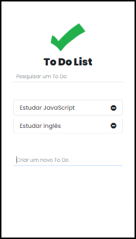

# To do list!

## Project Description

This project is a **to do list**, and is the second of the challenges proposed in the CJRM.

## Usage

No need to install anything. Just download the project, double click on the index.html file, and make your list! [Or you can access the production link here =)](https://focused-cori-cc9a51.netlify.app/).

## Preview

Below you see three images.
This first one is the empty list.

This second is the list with some to dos.

And the third is when a search is done.

